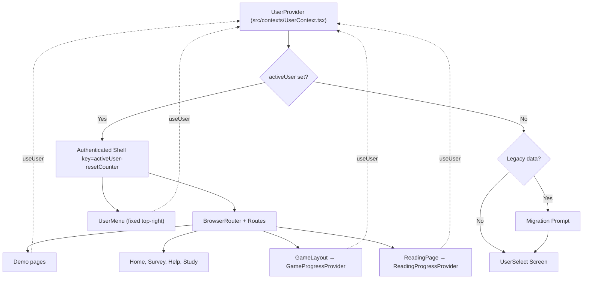
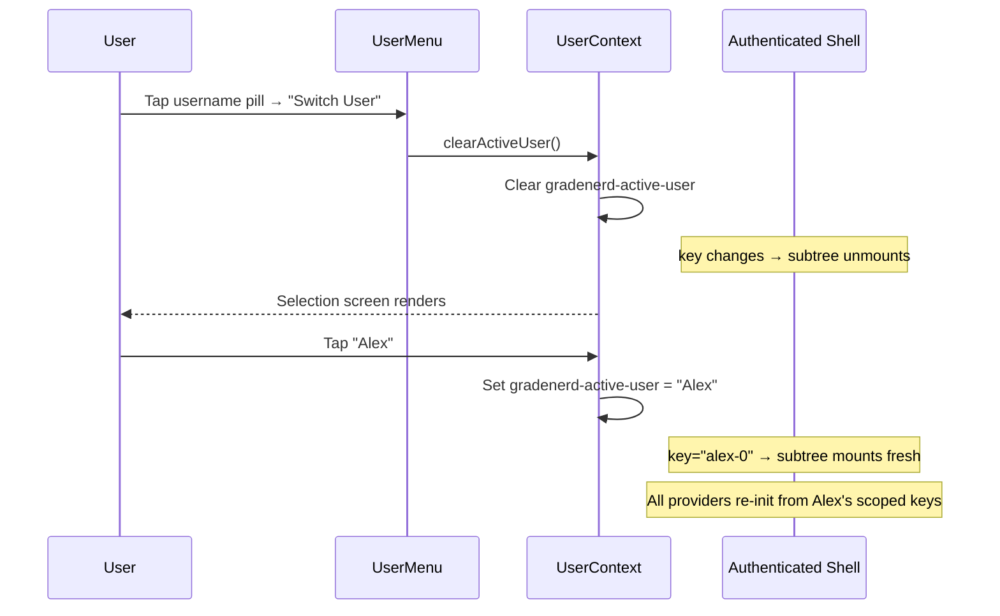
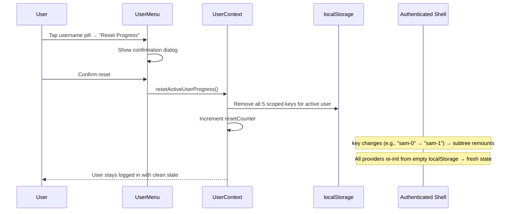

# feat: Add multi-user profiles with user-scoped progress

## Overview

Add a multi-user profile system that gates all app content behind a user selection screen. Each user gets independent, isolated progress across all modes (reading, game, demo). Includes user creation, deletion, legacy data migration, progress reset, and session persistence — all backed by localStorage with no server dependency.

## Problem Frame

Grade Nerd stores all progress in localStorage as a single anonymous user. In classroom and family settings, multiple learners share the same device, causing one child's progress to overwrite another's. There's no way to track individual progress or start fresh for a new learner. (see origin: docs/brainstorms/multi-user-profiles-requirements.md)

## Requirements Trace

- R1. User selection screen gates all content
- R2. Selection screen shows all usernames + create option
- R3. Tap username to enter (no password)
- R4. Alphanumeric usernames, max 20 characters
- R5. Case-insensitive unique usernames
- R6. 100-user cap with clear message
- R7. Independent reading progress per user
- R8. Independent game progress per user
- R9. Switching loads correct user's progress
- R10. Reset own progress from within app
- R11. Reset clears all progress, preserves username
- R12. Reset requires confirmation
- R13. Active user persists across reloads
- R14. Switch user returns to selection screen
- R15. Legacy data migration with name prompt on first upgrade
- R16. User deletion from selection screen
- R17. Deletion requires confirmation

## Scope Boundaries

- No passwords, authentication, or server-side storage (see origin)
- No cross-device sync
- No admin role — all users equal; any user can delete any user
- No per-mode reset from UserMenu — the UserMenu reset is all-or-nothing. Exception: the existing per-game reset button in `Game.tsx` stays as a convenience for resetting just game progress.
- Gate ALL routes including non-stateful ones
- All 5 localStorage keys are user-scoped: `gradenerd-reading`, `gradenerd-formula-forge`, `gradenerd-user-passion`, `gradenerd-viewed-topics`, `gradenerd-seen-intro`
- Concurrent tabs: unsupported, last-write-wins

## Context & Research

### Relevant Code and Patterns

**localStorage consumers (5 keys to user-scope):**

| File | Key | Init Pattern |
|------|-----|-------------|
| `src/contexts/ReadingProgressContext.tsx` | `gradenerd-reading` | Sync `useState(loadFromLocalStorage)` |
| `src/contexts/GameProgressContext.tsx` | `gradenerd-formula-forge` | Async `useEffect` on mount → refactor to sync `useState(load)` in Unit 6 |
| `src/hooks/useUserPassion.ts` | `gradenerd-user-passion` | `useEffect` on mount |
| `src/hooks/useProgress.ts` | `gradenerd-viewed-topics` | `useEffect` on mount |
| `src/pages/demo/Demo.tsx` | `gradenerd-seen-intro` | Inline `useState` initializer |

**Architectural patterns:**

- Context providers mounted per-mode: `ReadingProgressProvider` in `ReadingPage.tsx`, `GameProgressProvider` in `GameLayout.tsx`
- No app-level context providers — `index.tsx` renders `<App />` directly
- No route guard or protected route pattern exists
- `GameProgressContext` has existing `resetProgress()` and `migrateProgress()` functions
- Existing confirmation UI pattern in `Game.tsx` (inline confirm panel with `bg-red-50 border-2 border-red-200`)
- Consistent animation: fade-in with `{ opacity: 0, y: 20 }` to `{ opacity: 1, y: 0 }`
- Modal pattern: fixed overlay `bg-black/50 z-50` with centered `motion.div`
- Entry point `src/index.tsx` uses legacy `ReactDOM.render()` (not `createRoot`)

### Institutional Learnings

- **React key identity gap** (`docs/solutions/ui-bugs/decorative-avatar-overlap-freeze-reading.md`): Components using `useState` lazy initializers do not re-initialize unless React unmounts and remounts via key change. Critical for user switching — must key authenticated content on `activeUserId` to force clean remount.
- **State invariant completeness** (`docs/solutions/ui-bugs/react-state-version-lock-lesson-picker-reading.md`): Every function that reads/writes localStorage must use the user-scoped key. A single missed call causes cross-user data contamination. Centralize localStorage access behind a user-aware utility.

## Key Technical Decisions

- **Key-based remount over imperative reload**: When the active user changes, the entire authenticated content subtree remounts via `key={activeUserId}`. This forces all `useState` lazy initializers and `useEffect` mount hooks to re-run with the new user's scoped keys. The alternative (imperative reload methods on each context/hook) would require retrofitting every consumer and is fragile — `ReadingProgressContext`'s sync lazy init cannot reload without remounting. (informed by: `docs/solutions/ui-bugs/decorative-avatar-overlap-freeze-reading.md`)

- **Reset counter in remount key**: The authenticated shell key is `key={${activeUser}-${resetCounter}}`. When a user resets progress, the counter increments, forcing a full remount while the user stays logged in. All contexts/hooks re-initialize from localStorage (which was just cleared), producing fresh state without flashing the selection screen.

- **Centralized user-scoped key utility over scattered key construction**: A single `getUserKey(userId, baseKey)` function generates all scoped localStorage keys. All contexts and hooks use this utility. This prevents the "missed setter" bug class where one code path bypasses scoping. (informed by: `docs/solutions/ui-bugs/react-state-version-lock-lesson-picker-reading.md`)

- **Conditional render gate over route-level guard**: Since no route guard pattern exists and the gate applies to ALL routes (R1), conditionally render the entire `Routes` tree vs the selection screen based on `activeUser` in `UserContext`. Simpler than wrapping every route in a guard component.

- **UserContext above BrowserRouter**: `UserContext` provides `activeUser` to both the gate logic and all child components. Mounting it above the router ensures it's available everywhere including the selection screen. `BrowserRouter` lives inside the keyed authenticated wrapper — it recreates on user switch, which cleanly resets route state.

- **Shared persistent user menu**: A single `UserMenu` component renders in fixed position (top-right, next to existing hamburger in reading mode) across all authenticated routes. Avoids duplicating switch/reset UI in every mode's nav. (User decision)

- **Standalone hooks read userId from UserContext**: `useUserPassion` and `useProgress` call `useUser()` internally to get the active userId for scoped key construction. No API change needed for consumers. The key-based remount ensures they re-initialize correctly on user switch.

- **Store username as entered, compare case-insensitively**: Registry stores the original casing for display. Uniqueness checks compare lowercased values.

- **Selection screen sorts alphabetically**: Case-insensitive alphabetical sort for easy scanning in classroom settings. (User decision)

- **Migration prompt is non-dismissable**: Since R1 gates all content, there's no valid app state without an active user. The migration name prompt must be completed to proceed.

- **Deleted active user clears session**: If a deleted username matches `gradenerd-active-user`, the session key is cleared and the selection screen shows.

- **Reset includes `gradenerd-seen-intro`**: The origin doc groups it with other user-scoped keys under R11's "all progress" definition.

## Open Questions

### Resolved During Planning

- **Where do switch user and reset progress live?** → Shared persistent `UserMenu` component, positioned top-right next to existing hamburger in reading mode. Consistent across all authenticated routes.
- **Remount vs imperative reload on user switch?** → Key-based remount via `key={activeUserId}`. `ReadingProgressContext`'s sync lazy init cannot reload without remounting.
- **How do standalone hooks get userId?** → Call `useUser()` from `UserContext` internally. Key-based remount ensures re-initialization.
- **Migration cancellation behavior?** → Non-dismissable. App gate (R1) means no valid state without a user.
- **Username display casing?** → Store as entered, compare lowercase.
- **Selection screen sort order?** → Alphabetical, case-insensitive.
- **Minimum username length?** → 1 character. Empty string is invalid.

### Deferred to Implementation

- **Exact pixel positioning of UserMenu relative to hamburger and other fixed chrome**: Depends on visual testing across viewport sizes.
- **UserMenu z-index**: Planned at z-40 but HomePage navbar is z-50. Audit z-index layering across pages during Unit 8 and adjust to ensure menu is always tappable.
- **Animation details for selection screen transitions**: Follow existing fade-in patterns, tune during implementation.
- **Whether `index.tsx` should be upgraded to `createRoot`**: Out of scope but the legacy `ReactDOM.render` may cause React 18 warnings with the new provider tree.

## High-Level Technical Design

> *This illustrates the intended approach and is directional guidance for review, not implementation specification. The implementing agent should treat it as context, not code to reproduce.*

### Component Hierarchy



### localStorage Key Strategy

```
Registry:       gradenerd-users              → ["Sam", "Alex", ...]
Session:        gradenerd-active-user        → "Sam"
User-scoped:    gradenerd-{userId}-reading         → {ReadingProgress}
                gradenerd-{userId}-formula-forge    → {GameProgress}
                gradenerd-{userId}-user-passion     → "dinosaurs"
                gradenerd-{userId}-viewed-topics    → ["topic1", ...]
                gradenerd-{userId}-seen-intro       → "true"

userId = username.toLowerCase()
```

### User Switch Flow



### Progress Reset Flow



## Implementation Units

- [ ] **Unit 1: UserContext and storage utility**

  **Goal:** Create the foundational user management layer — user registry CRUD, active user state, session persistence, reset counter, and the scoped localStorage key utility.

  **Requirements:** R2, R3, R4, R5, R6, R9, R10, R11, R13, R14

  **Dependencies:** None

  **Files:**
  - Create: `src/contexts/UserContext.tsx`
  - Create: `src/lib/userStorage.ts`

  **Approach:**
  - `UserContext` manages: `users: string[]` (registry), `activeUser: string | null`, `resetCounter: number`, and methods: `createUser`, `deleteUser`, `setActiveUser`, `clearActiveUser`, `resetActiveUserProgress`
  - Registry stored in `gradenerd-users` as JSON array of usernames (original casing)
  - Session stored in `gradenerd-active-user` as plain string
  - `createUser` validates: alphanumeric only, 1-20 chars, case-insensitive uniqueness, cap at 100
  - `deleteUser` removes from registry, deletes all scoped keys via `removeAllUserKeys`, clears session if matches active user
  - `resetActiveUserProgress` removes all 5 scoped keys for active user then increments `resetCounter`
  - `useUser()` consumer hook with throw guard (following existing context pattern)
  - `userStorage.ts` exports `getUserKey(userId: string, baseKey: string): string` → `gradenerd-${userId.toLowerCase()}-${baseKey}`
  - `userStorage.ts` exports `SCOPED_BASE_KEYS` array listing all 5 base keys, and `removeAllUserKeys(userId: string)` that deletes all of them
  - Initialize registry from `gradenerd-users` on mount; initialize active user from `gradenerd-active-user`; validate active user still exists in registry on load

  **Patterns to follow:**
  - `src/contexts/ReadingProgressContext.tsx` — context creation pattern (`createContext<T | null>(null)`, provider, consumer hook with throw guard)
  - `src/contexts/GameProgressContext.tsx` — `STORAGE_KEY` constant and sync-to-localStorage useEffect

  **Test scenarios:**
  - Happy path: create user "Sam" → user in registry, `gradenerd-users` updated
  - Happy path: `setActiveUser("Sam")` → `gradenerd-active-user` set, `activeUser` state updated
  - Happy path: `clearActiveUser()` → session cleared, `activeUser` null
  - Happy path: `resetActiveUserProgress()` → 5 scoped keys removed, `resetCounter` incremented
  - Edge case: create "sam" when "Sam" exists → rejected (case-insensitive uniqueness)
  - Edge case: create with empty string → rejected
  - Edge case: create with 21 characters → rejected
  - Edge case: create with special characters "Sam!" → rejected
  - Edge case: create 100th user → succeeds; 101st → rejected with cap message
  - Edge case: delete active user → session cleared, `activeUser` becomes null
  - Edge case: `setActiveUser("deleted-user")` where user not in registry → fallback to null
  - Error path: `useUser()` called outside `UserProvider` → throws descriptive error
  - Integration: `getUserKey("Sam", "reading")` → `"gradenerd-sam-reading"`
  - Integration: `removeAllUserKeys("Sam")` → all 5 `gradenerd-sam-*` keys removed

  **Verification:**
  - `UserContext` provides reactive user list and active user state
  - All CRUD operations persist to localStorage immediately
  - Scoped key utility generates deterministic, lowercase-normalized keys

---

- [ ] **Unit 2: User selection screen**

  **Goal:** Build the gate screen that displays the user list, handles user creation and deletion, and serves as the entry point when no user is active.

  **Requirements:** R1, R2, R3, R4, R5, R6, R16, R17

  **Dependencies:** Unit 1

  **Files:**
  - Create: `src/pages/UserSelect.tsx`

  **Approach:**
  - Full-screen component rendered when `activeUser` is null
  - Shows alphabetically sorted user list (case-insensitive sort)
  - Each user row: tap name to select, delete icon/button with confirmation
  - "Create new user" section with username input + validation feedback
  - Deletion confirmation uses existing inline confirm pattern from `Game.tsx`
  - Consistent styling: `bg-graph-paper` background (matches reading mode), `bg-white border-2 border-black rounded-xl` panels
  - Fade-in animation matching existing patterns
  - When user list is empty (first launch, no legacy data), show prominent create CTA
  - Validation messages: "Letters and numbers only", "Username already exists", "Maximum 20 characters", "Maximum 100 users reached"

  **Patterns to follow:**
  - `src/pages/game/Game.tsx` lines 185-217 — inline confirmation UI pattern
  - `src/components/ui/Button.tsx` — reusable button component
  - Existing fade-in: `{ initial: { opacity: 0, y: 20 }, animate: { opacity: 1, y: 0 }, transition: { duration: 0.5 } }`

  **Test scenarios:**
  - Happy path: empty list → shows create CTA → enter "Sam" → user created, app entered
  - Happy path: 3 users exist → shown alphabetically → tap "Alex" → app entered as Alex
  - Happy path: delete "Sam" → confirmation shown → confirm → Sam removed from list
  - Edge case: deletion cancelled → user preserved, confirmation dismissed
  - Edge case: 100 users → create section shows cap message instead of form
  - Edge case: single user in list → still shows list (no auto-bypass)
  - Error path: enter "Sam!" → inline validation "Letters and numbers only"
  - Error path: enter "Sam" when "sam" exists → inline error "Username already exists"
  - Error path: enter empty string → submit disabled or inline error

  **Verification:**
  - Selection screen renders when no active user
  - Users can be created, selected, and deleted
  - All validation rules enforced with clear feedback

---

- [ ] **Unit 3: Legacy data migration**

  **Goal:** Detect pre-existing unscoped localStorage data on first launch after upgrade, prompt for a username, and migrate data to user-scoped keys.

  **Requirements:** R15

  **Dependencies:** Unit 1, Unit 2

  **Files:**
  - Modify: `src/contexts/UserContext.tsx` (add migration detection flag)
  - Modify: `src/pages/UserSelect.tsx` (add migration prompt UI variant)
  - Create: `src/lib/migrateLegacyData.ts`

  **Approach:**
  - On `UserContext` initialization: if `gradenerd-users` does NOT exist in localStorage, check for any of the 5 legacy keys
  - If legacy keys found, expose a `migrationNeeded: boolean` flag from `UserContext`
  - `UserSelect` checks `migrationNeeded` — if true, shows migration prompt instead of normal empty-state
  - Migration prompt: non-dismissable name entry form with same validation as R4-R5, messaging like "Welcome back! Name your profile to keep your progress."
  - On submission: create user via `createUser`, call `migrateLegacyData(userId)`, set active user
  - `migrateLegacyData(userId)`: for each of the 5 legacy keys, if the key exists, read its value, write to the scoped equivalent via `getUserKey`, then remove the legacy key
  - Write all scoped keys first, then remove legacy keys only after all writes succeed

  **Patterns to follow:**
  - `src/contexts/GameProgressContext.tsx` `migrateProgress()` — existing migration precedent

  **Test scenarios:**
  - Happy path: legacy `gradenerd-reading` exists, no `gradenerd-users` → migration prompt shown → enter "Sam" → data migrated to `gradenerd-sam-reading`, legacy key deleted
  - Happy path: no legacy keys, no `gradenerd-users` → normal empty-state creation flow
  - Happy path: `gradenerd-users` already exists (returning user) → no migration check
  - Edge case: only some legacy keys exist → migrate what exists, skip absent keys
  - Edge case: migration name fails validation → inline error, user retries
  - Integration: after migration, selecting the migrated user loads the original progress data correctly

  **Verification:**
  - Legacy data detected on upgrade and migrated to named profile
  - Legacy keys removed after successful migration
  - Migrated user can access their original progress in both reading and game modes

---

- [ ] **Unit 4: App shell integration and route gating**

  **Goal:** Wire `UserContext` into the app root, conditionally render the selection screen vs authenticated content, and set up the key-based remount for clean user switching and progress reset.

  **Requirements:** R1, R9, R13, R14

  **Dependencies:** Unit 1, Unit 2

  **Files:**
  - Modify: `src/App.tsx`
  - Modify: `src/index.tsx` (wrap with `UserProvider`)

  **Approach:**
  - Mount `UserProvider` in `index.tsx` wrapping `<App />`
  - In `App.tsx`, use `useUser()` to get `activeUser` and `resetCounter`
  - If `activeUser` is null → render `<UserSelect />`
  - If `activeUser` is set → render authenticated wrapper with `key={${activeUser}-${resetCounter}}` containing `<BrowserRouter>`, `<UserMenu />`, and all `<Routes>`
  - The key forces full remount on user switch (activeUser changes) AND on progress reset (resetCounter increments)
  - `BrowserRouter` lives inside the keyed wrapper — it recreates on user switch, cleanly resetting route state. Preserve the existing `basename="/grade-nerd"` prop on BrowserRouter when relocating it inside the keyed wrapper.
  - `UserMenu` also lives inside the keyed wrapper so it can access child contexts if needed
  - All existing routes preserved unchanged inside the `<Routes>` block

  **Patterns to follow:**
  - `src/pages/game/GameLayout.tsx` — layout wrapping pattern with provider + child content
  - `src/App.tsx` — preserve all existing route definitions

  **Test scenarios:**
  - Happy path: no active user → selection screen shown, no routes accessible
  - Happy path: active user set → all routes accessible, user menu visible
  - Happy path: reload with active session → bypasses selection screen, resumes
  - Happy path: switch user → subtree unmounts, selection screen shows
  - Edge case: active user in localStorage but deleted from registry → session cleared, selection screen shown
  - Integration: after user switch, `ReadingProgressContext` re-initializes from new user's scoped key
  - Integration: after user switch, `GameProgressContext` re-initializes from new user's scoped key
  - Integration: after reset, key changes but user stays logged in with fresh state

  **Verification:**
  - All routes gated behind user selection
  - User switching causes clean remount of all child components
  - Progress reset causes clean remount without returning to selection screen
  - Session persists across reloads

---

- [ ] **Unit 5: Refactor ReadingProgressContext for user-scoped storage**

  **Goal:** Make `ReadingProgressContext` read/write user-scoped localStorage keys. Add a reset method.

  **Requirements:** R7, R9, R11

  **Dependencies:** Unit 1, Unit 4

  **Files:**
  - Modify: `src/contexts/ReadingProgressContext.tsx`

  **Approach:**
  - Import `useUser` from `UserContext` and `getUserKey` from `userStorage`
  - Replace hardcoded `STORAGE_KEY` with `getUserKey(activeUser, 'reading')`
  - Since the provider remounts on user switch (via key change in Unit 4), the sync `useState(loadFromLocalStorage)` lazy initializer naturally re-runs with the new scoped key
  - The `useEffect` that syncs state to localStorage must also use the scoped key
  - Add `resetProgress()` method: sets state to initial defaults and writes to scoped localStorage key

  **Patterns to follow:**
  - `src/contexts/GameProgressContext.tsx` `resetProgress()` — existing reset pattern
  - `src/contexts/ReadingProgressContext.tsx` — preserve existing sync init pattern, swap key source

  **Test scenarios:**
  - Happy path: user "Sam" loads reading → reads from `gradenerd-sam-reading`
  - Happy path: user "Sam" completes lesson → writes to `gradenerd-sam-reading`
  - Happy path: user "Sam" resets progress → scoped key set to initial state
  - Edge case: no scoped key exists for new user → initializes with default fresh progress
  - Integration: user "Sam" has progress, switch to "Alex" → Alex sees fresh reading, Sam's data intact in localStorage

  **Verification:**
  - Reading progress fully isolated between users
  - Reset returns reading to initial state
  - Existing reading functionality unaffected (lessons, completion, word counting, mastery)

---

- [ ] **Unit 6: Refactor GameProgressContext for user-scoped storage**

  **Goal:** Make `GameProgressContext` read/write user-scoped localStorage keys.

  **Requirements:** R8, R9, R11

  **Dependencies:** Unit 1, Unit 4

  **Files:**
  - Modify: `src/contexts/GameProgressContext.tsx`

  **Approach:**
  - Import `useUser` and `getUserKey`
  - Replace hardcoded `STORAGE_KEY` with `getUserKey(activeUser, 'formula-forge')`
  - Refactor from async two-phase init (`useState(initial)` + `useEffect` load) to sync `useState(loadFromLocalStorage)` — eliminates the save-on-mount race where the save effect overwrites real data with blank state before the load completes. This race becomes destructive with key-based remount firing on every user switch.
  - Existing `resetProgress()` already exists — ensure it writes to the scoped key
  - Existing `migrateProgress()` still works (patches shape, not key) — ensure it reads/writes the scoped key

  **Patterns to follow:**
  - `src/contexts/GameProgressContext.tsx` — preserve existing async init pattern, swap key source

  **Test scenarios:**
  - Happy path: user "Sam" enters game → reads from `gradenerd-sam-formula-forge`
  - Happy path: user "Sam" completes quiz → writes to `gradenerd-sam-formula-forge`
  - Edge case: no scoped key for new user → creates initial progress
  - Edge case: scoped key has old schema → `migrateProgress()` patches correctly
  - Integration: user "Sam" has game progress, switch to "Alex" → Alex sees fresh game state

  **Verification:**
  - Game progress fully isolated between users
  - Existing game functionality unaffected (topics, quizzes, avatar, points)

---

- [ ] **Unit 7: Refactor standalone hooks and Demo.tsx for user-scoped storage**

  **Goal:** Make `useUserPassion`, `useProgress`, and Demo's `gradenerd-seen-intro` use user-scoped localStorage keys.

  **Requirements:** R9, R11 (scope boundary: passion, viewed-topics, seen-intro are user-scoped per origin doc)

  **Dependencies:** Unit 1, Unit 4

  **Files:**
  - Modify: `src/hooks/useUserPassion.ts`
  - Modify: `src/hooks/useProgress.ts`
  - Modify: `src/pages/demo/Demo.tsx`

  **Approach:**
  - `useUserPassion`: import `useUser` and `getUserKey`. Replace hardcoded key with `getUserKey(activeUser, 'user-passion')`. Key-based remount ensures `useEffect` re-runs on user switch.
  - `useProgress`: same pattern — replace key with `getUserKey(activeUser, 'viewed-topics')`.
  - `Demo.tsx`: replace inline `localStorage.getItem('gradenerd-seen-intro')` with scoped key via `useUser()` + `getUserKey()`. Compute the scoped key at component top level (e.g., `const seenIntroKey = getUserKey(activeUser, 'seen-intro')`) so it is available to both the `useState` lazy initializer (which cannot call hooks) and the `handleStartDemo` write.
  - No API changes to hook consumers — hooks internally get userId from `UserContext`.

  **Patterns to follow:**
  - `src/hooks/useUserPassion.ts` — preserve existing hook shape
  - `src/hooks/useProgress.ts` — preserve existing hook shape

  **Test scenarios:**
  - Happy path: user "Sam" sets passion "dinosaurs" → stored at `gradenerd-sam-user-passion`
  - Happy path: user "Sam" views topic → stored at `gradenerd-sam-viewed-topics`
  - Happy path: user "Sam" sees demo intro → stored at `gradenerd-sam-seen-intro`
  - Edge case: new user has no passion → passion is empty/null
  - Edge case: new user hasn't seen intro → intro shown on first demo visit
  - Integration: "Sam" has passion "dinosaurs", switch to "Alex" → Alex has no passion, Survey shows empty
  - Integration: reset "Sam" → passion, viewed-topics, and seen-intro all cleared

  **Verification:**
  - All 3 standalone storage consumers use user-scoped keys
  - No cross-user data leakage
  - Existing hook behavior preserved for consumers

---

- [ ] **Unit 8: Shared user menu component**

  **Goal:** Create a persistent user menu showing the active username with a dropdown for switching users and resetting progress.

  **Requirements:** R10, R11, R12, R14

  **Dependencies:** Unit 1, Unit 4

  **Files:**
  - Create: `src/components/UserMenu.tsx`
  - Modify: `src/pages/reading/ReadingPage.tsx` (adjust hamburger positioning to accommodate menu)

  **Approach:**
  - Fixed-position component: top-right, to the left of reading's hamburger (which is at `fixed top-4 right-4 z-40`). Position at approximately `fixed top-4 right-16 z-40` — exact offset tuned during implementation.
  - On pages without a hamburger, the menu sits alone in the top-right area.
  - Shows active username in a pill/badge: white bg, black border, rounded — matching existing chrome style.
  - Tap pill to toggle dropdown with two actions: "Switch User" and "Reset Progress".
  - "Switch User" calls `clearActiveUser()` → triggers gate → selection screen.
  - "Reset Progress" shows inline confirmation panel (following `Game.tsx` pattern with `bg-red-50` styling and warning text). On confirm: calls `resetActiveUserProgress()` from `UserContext`, which removes all 5 scoped keys and increments `resetCounter`, triggering the key-based remount.
  - Dropdown closes on outside click.
  - Framer Motion for dropdown open/close animation.

  **Patterns to follow:**
  - `src/pages/game/Game.tsx` lines 185-217 — inline confirmation UI pattern
  - `src/pages/reading/ReadingPage.tsx` hamburger button — fixed positioning and z-index
  - `src/pages/reading/components/LessonPicker.tsx` — overlay/drawer with outside-click dismiss

  **Test scenarios:**
  - Happy path: tap username pill → dropdown opens with "Switch User" and "Reset Progress"
  - Happy path: tap "Switch User" → returns to selection screen, previous user's data preserved
  - Happy path: tap "Reset Progress" → confirmation → confirm → all progress cleared, user stays logged in with fresh state
  - Edge case: reset cancelled → progress unchanged, dropdown closes
  - Edge case: outside click → dropdown closes
  - Edge case: user menu visible on all routes (reading, game, demo, home, survey, help)
  - Integration: after reset, reading page shows lesson 1 with no completion data
  - Integration: after reset, game page shows initial state (no points, default avatar)
  - Integration: after reset, demo shows intro again

  **Verification:**
  - User menu visible and functional on all authenticated routes
  - Switch user returns to selection screen cleanly
  - Reset clears all progress with confirmation, user stays logged in with fresh state
  - Menu does not overlap or interfere with existing fixed chrome

## System-Wide Impact

- **Interaction graph:** `UserContext` is a new top-level provider that all existing contexts and hooks depend on. The key-based remount mechanism causes full subtree teardown/rebuild on user switch — all `useState`, `useEffect`, and `useMemo` hooks re-initialize.
- **Error propagation:** localStorage failures (quota exceeded, access denied) during user creation or progress saving should show user-facing errors. Existing code has no try/catch around `setItem` — this is a pre-existing gap, not in scope to fix comprehensively, but new code (`UserContext`, migration) should handle write errors.
- **State lifecycle risks:** Migration (Unit 3) is the highest-risk operation — partial failure could leave data inconsistent. Mitigation: write all scoped keys first, delete originals only after all writes succeed.
- **API surface parity:** No external APIs affected. Internal hook APIs (`useUserPassion`, `useProgress`) remain unchanged for consumers — they internally source userId from `UserContext`.
- **Integration coverage:** User switch must be tested with real contexts to verify no stale state. The key-based remount is the critical mechanism — mock-based tests would miss it entirely.
- **Unchanged invariants:** All existing route paths, component APIs, lesson data, game data, and avatar system are unchanged. The only change is the source of localStorage keys and the addition of the user gate + menu.

## Risks & Dependencies

| Risk | Mitigation |
|------|------------|
| Stale state after user switch | Key-based remount forces full re-initialization; verified by institutional learning from avatar bug |
| Cross-user data leak from missed localStorage call | Centralized `getUserKey()` utility; grep audit for raw `localStorage.getItem/setItem` calls |
| Migration partial failure leaves inconsistent state | Write all scoped keys first, delete legacy keys only after all writes succeed |
| UserMenu positioning conflicts with existing fixed chrome | Visual testing across reading, game, demo; adjust z-index and offsets |
| No test infrastructure to catch regressions | Manual testing across all modes after each unit |
| `ReactDOM.render` deprecation warnings | Out of scope; note for follow-up |

## Sources & References

- **Origin document:** [docs/brainstorms/multi-user-profiles-requirements.md](docs/brainstorms/multi-user-profiles-requirements.md)
- Related learning: [docs/solutions/ui-bugs/decorative-avatar-overlap-freeze-reading.md](docs/solutions/ui-bugs/decorative-avatar-overlap-freeze-reading.md) — React key identity gap
- Related learning: [docs/solutions/ui-bugs/react-state-version-lock-lesson-picker-reading.md](docs/solutions/ui-bugs/react-state-version-lock-lesson-picker-reading.md) — state invariant completeness
- Related code: `src/contexts/ReadingProgressContext.tsx`, `src/contexts/GameProgressContext.tsx`
- Related code: `src/hooks/useUserPassion.ts`, `src/hooks/useProgress.ts`
- Related code: `src/pages/demo/Demo.tsx`
- Related code: `src/App.tsx`, `src/index.tsx`
